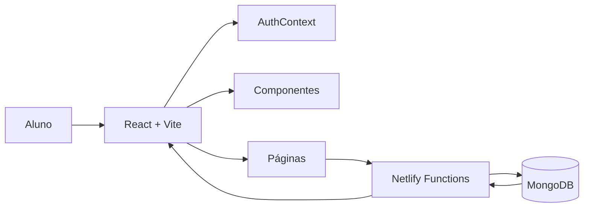

<div align="center">


# 🎓 CID - Central de Informação Discente

**Projeto acadêmico desenvolvido para centralizar e simplificar o acesso às informações institucionais da Universidade Federal de Sergipe (UFS).**

<p>
  
  
  
  
  
  
</p>

</div>

---

> [!NOTE]
> O **CID (Central de Informação Discente)** é um projeto acadêmico desenvolvido para reunir, em uma única plataforma, informações sobre assistência estudantil, pesquisa, extensão e demais oportunidades oferecidas pela Universidade Federal de Sergipe (UFS).
>
> A proposta é reduzir a dependência da divulgação informal ("boca a boca"), centralizando editais, programas e orientações em um ambiente intuitivo que simula a experiência de autenticação do SIGAA.

---

# 📑 Sumário

- [✨ Funcionalidades](#-funcionalidades)
- [🏗 Arquitetura do Sistema](#-arquitetura-do-sistema)
- [🛠 Tecnologias Utilizadas](#-tecnologias-utilizadas)
- [📁 Estrutura do Projeto](#-estrutura-do-projeto)
- [📄 Licença](#-licença)
- [👨‍💻 Autor](#-autor)

---

# ✨ Funcionalidades

O sistema disponibiliza os seguintes recursos:

- 🔐 Autenticação simulando o acesso ao SIGAA utilizando JWT.
- 📊 Dashboard personalizado para o estudante.
- 📖 Explicações detalhadas sobre programas e benefícios estudantis.
- 🔎 Pesquisa e filtragem de editais por categoria.
- 🎓 Informações sobre:
  - Assistência Estudantil (PROEST)
  - Pesquisa (PIBIC)
  - Extensão
  - Ligas Acadêmicas
  - Estágios
- 🔍 Sistema de busca integrado.
- 📱 Interface totalmente responsiva.
- 🍪 Persistência da autenticação através de Cookies e JWT.

---

# 🏗 Arquitetura do Sistema

A aplicação utiliza uma arquitetura híbrida baseada em **Serverless**, separando o frontend em React das funções de backend hospedadas no Netlify.



# 🛠 Tecnologias Utilizadas

## Frontend

| Categoria | Tecnologia |
|-----------|------------|
| Framework | React 19 |
| Build Tool | Vite 8 |
| Estilização | Tailwind CSS 4 |
| Gerenciamento de Estado | Context API |
| Autenticação | jwt-decode |

---

## Backend

| Categoria | Tecnologia |
|-----------|------------|
| Runtime | Node.js |
| API | Netlify Functions |
| Banco de Dados | MongoDB |
| Driver | MongoDB Driver |
| Autenticação | JSON Web Token (JWT) |

---

## Deploy

| Serviço | Finalidade |
|----------|------------|
| Netlify | Hospedagem do Frontend e das Serverless Functions |

---
---

# 📁 Estrutura do Projeto

```text
CID_UFS/
├── netlify/
│   └── functions/
│       └── login.js
│
├── public/
│   └── ufsLogo.svg
│
├── src/
│   ├── components/
│   │   └── Layout.jsx
│   │
│   ├── context/
│   │   └── AuthContext.jsx
│   │
│   ├── pages/
│   │   ├── Editais/
│   │   ├── Login/
│   │   ├── explicacaoCategoria/
│   │   └── home/
│   │
│   ├── App.jsx
│   ├── index.css
│   └── main.jsx
│
├── package.json
├── vite.config.js
├── .gitignore
└── README.md
```

---

# 📄 Licença

Este projeto está licenciado sob a licença **MIT**.

Consulte o arquivo **LICENSE** para mais informações.

---

# 👨‍💻 Autor

**Silas Santos**

Projeto desenvolvido como parte das atividades acadêmicas da **Universidade Federal de Sergipe (UFS)**.

---

<div align="center">

## ⭐ Gostou do projeto?

Se este projeto foi útil para você, considere deixar uma **⭐** no repositório.

Desenvolvido com ❤️ utilizando **React**, **Vite**, **Tailwind CSS**, **MongoDB** e **Netlify**.

</div>
